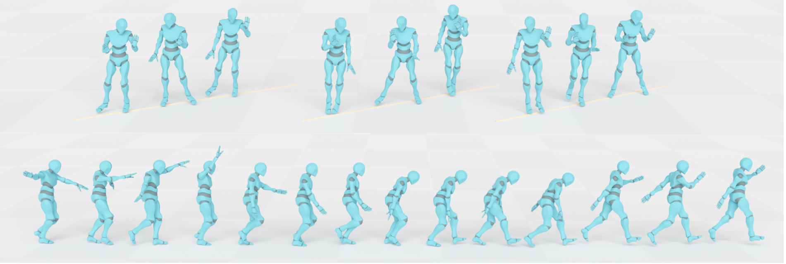

 # <p align="center"> Taming Diffusion Probabilistic Models for Character Control </p>

 #####  <p align="center"> [Rui Chen*](https://aruichen.github.io/), [Mingyi Shi*](https://rubbly.cn/), [Shaoli Huang](https://scholar.google.com/citations?user=o31BPFsAAAAJ&hl=en), [Ping Tan](https://ece.hkust.edu.hk/pingtan), [Taku Komura](https://scholar.google.com.hk/citations?user=TApLOhkAAAAJ&hl=en), [Xuelin Chen](https://xuelin-chen.github.io/)</p>
 ##### <p align="center"> SIGGRAPH 2024 (Conference Track)
 ##### <p align="center"> *equal contribution
 
#### <p align="center">[ArXiv](https://arxiv.org/abs/2404.15121) | [Project Page](https://aiganimation.github.io/CAMDM/) | [Video](https://www.youtube.com/watch?v=rUAez9tytAA) | [Unity demo](https://drive.google.com/file/d/1NYXP-fbEegErfaIgtHXvvrrfLXUSqYXg/view?usp=sharing)</p>

<p align="center">
  
</p>

# Update log
- (2024.04.24) 
  - Release the windows Unity demo (GPU) trained in 100style dataset.

## Todo
- [x] Release unity .exe demo in windows. （2024.04.24)
- [ ] Release the training code in pytorch and inference code in unity.

## BibTex
```
@InProceedings{chen2024taming,
        title={Taming Diffusion Probabilistic Models for Character Control},
        author={Rui Chen and Mingyi Shi and Shaoli Huang and Ping Tan and Taku Komura and Xuelin Chen},
        year={2024},
        eprint={2404.15121},
        archivePrefix={arXiv},
        primaryClass={cs.GR}
    }
```
